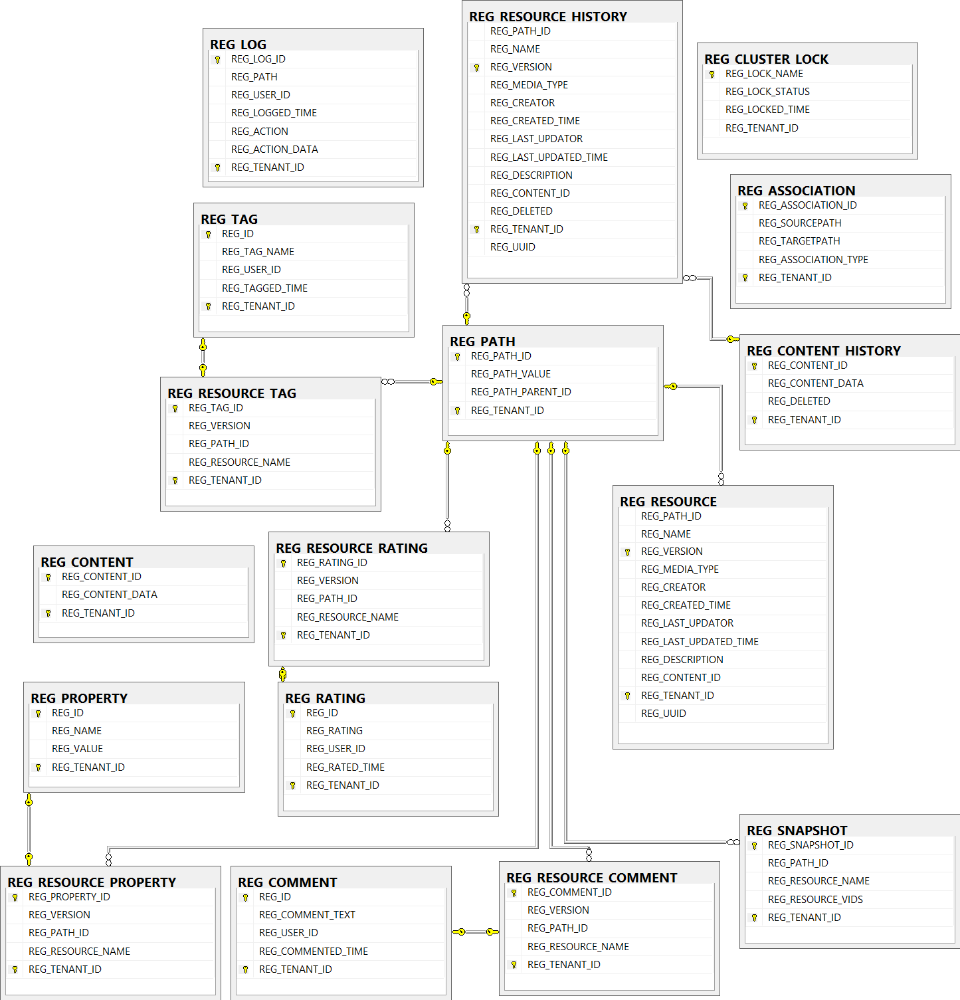
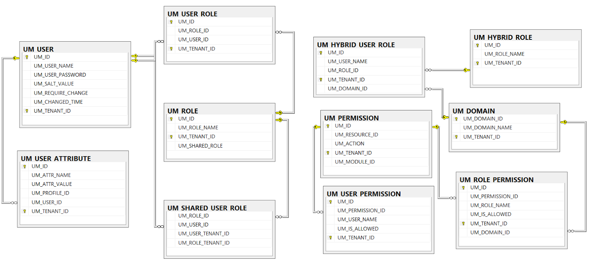
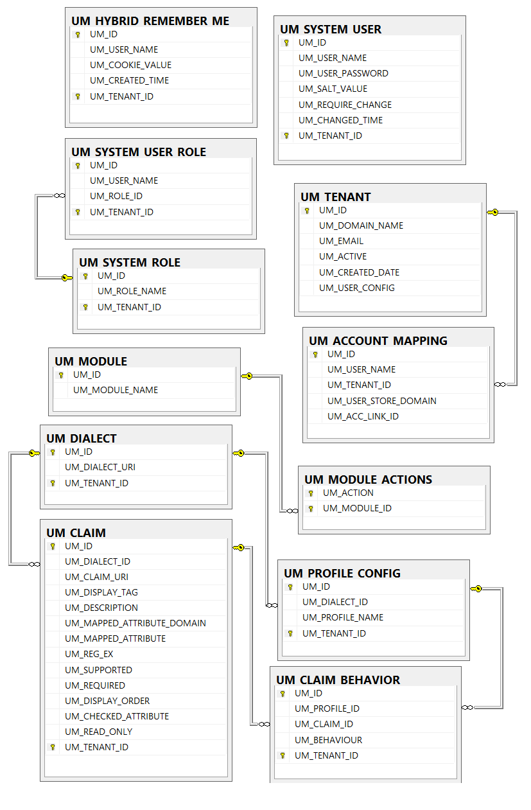
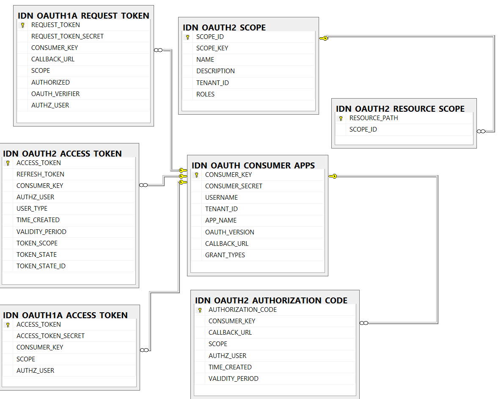
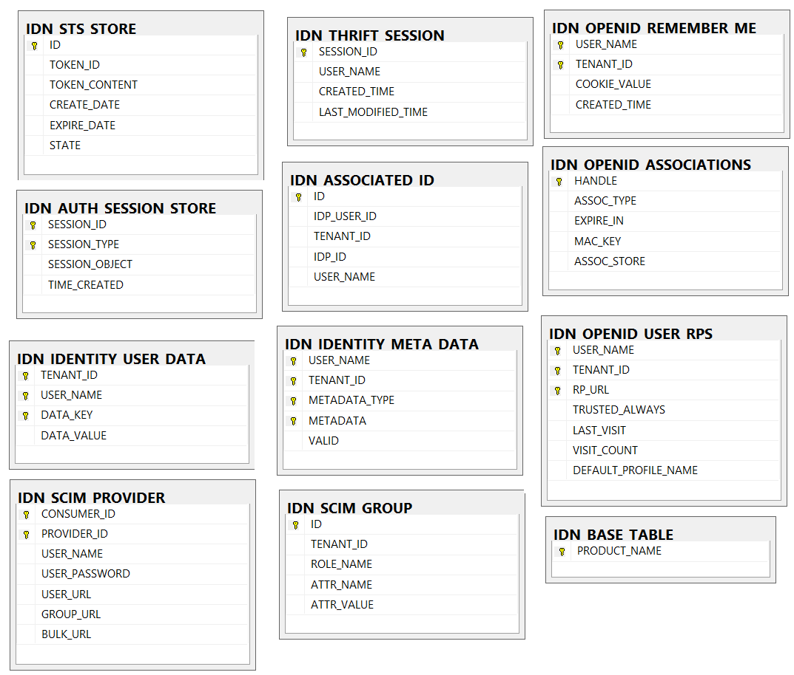
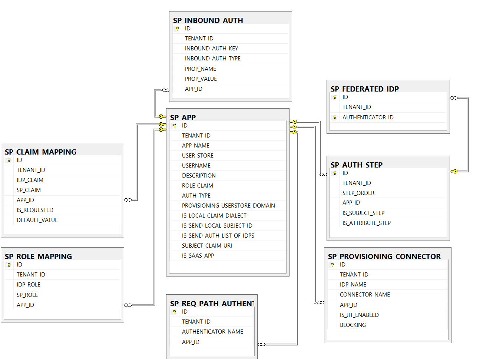
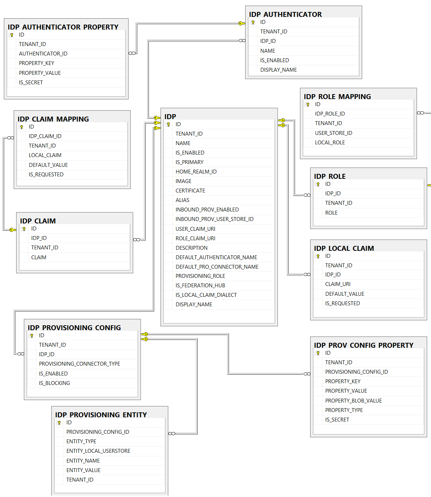
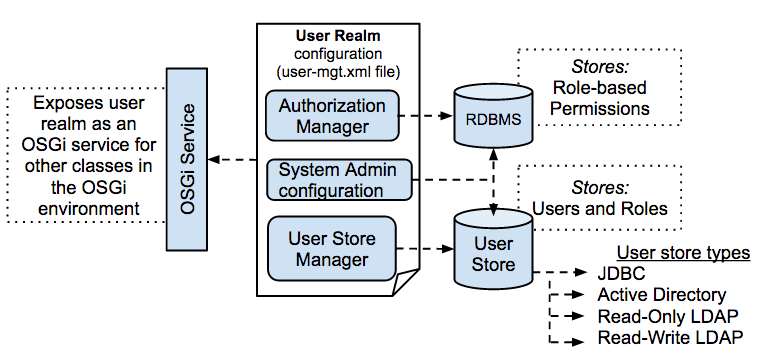
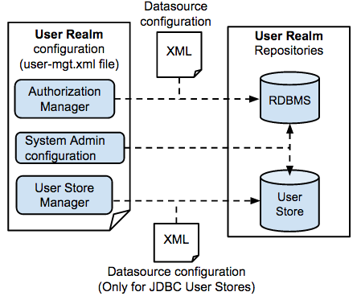

[TOC]


## 第一部分 【实战】产品环境中部署IS之切换到Oracle数据库

默认情况下，WSO2产品使用嵌入式H2数据库作为存储用户管理和注册表数据的数据库。 下面给出了为此目的使用Oracle数据库需要遵循的步骤。


- [设置数据源配置](https://docs.wso2.com/display/ADMIN44x/Changing+to+Oracle#ChangingtoOracle-Settingupdatasourceconfigurations)
  - [更改默认的WSO2_CARBON_DB数据源](https://docs.wso2.com/display/ADMIN44x/Changing+to+Oracle#ChangingtoOracle-ChangingthedefaultdatabaseChangingthedefaultWSO2_CARBON_DBdatasource)
  - [配置新数据源以管理注册表或用户管理数据](https://docs.wso2.com/display/ADMIN44x/Changing+to+Oracle#ChangingtoOracle-ConfiguringanewdatabaseConfiguringnewdatasourcestomanageregistryorusermanagementdata)
- [创建数据库表](https://docs.wso2.com/display/ADMIN44x/Changing+to+Oracle#ChangingtoOracle-Creatingthedatabasetables)


在你开始之前

在按照使用Oracle配置产品的步骤之前，您需要设置Oracle。 有关更多信息，请参阅[设置Oracle](https://translate.googleusercontent.com/translate_c?depth=1&rurl=translate.google.com.hk&sl=en&sp=nmt4&tl=zh-CN&u=https://docs.wso2.com/display/ADMIN44x/Setting%2Bup%2BOracle&xid=17259,15700022,15700186,15700191,15700253,15700256,15700259&usg=ALkJrhhpTpFoqOfn1Idqo3FJy6x_3iU10g) 。

### 设置数据源配置

数据源用于建立与数据库的连接。 默认情况下， `WSO2_CARBON_DB`数据源用于连接到默认H2数据库，该数据库存储注册表和用户管理数据。 在设置Oracle数据库以替换默认H2数据库之后，请[更改`WSO2_CARBON_DB`数据源的默认配置](https://translate.googleusercontent.com/translate_c?depth=1&rurl=translate.google.com.hk&sl=en&sp=nmt4&tl=zh-CN&u=https://docs.wso2.com/display/ADMIN44x/Changing%2Bto%2BOracle&xid=17259,15700022,15700186,15700191,15700253,15700256,15700259&usg=ALkJrhivK3CJmGoNGh3yq_xPzcBkEvEN3A#ChangingtoOracle-Changingthedefaultdatabase) ，或者[配置新数据源](https://translate.googleusercontent.com/translate_c?depth=1&rurl=translate.google.com.hk&sl=en&sp=nmt4&tl=zh-CN&u=https://docs.wso2.com/display/ADMIN44x/Changing%2Bto%2BOracle&xid=17259,15700022,15700186,15700191,15700253,15700256,15700259&usg=ALkJrhivK3CJmGoNGh3yq_xPzcBkEvEN3A#ChangingtoOracle-Configuringanewdatabase)以将其指向新数据库，如下所述。

#### 更改默认的WSO2_CARBON_DB数据源

请按照以下步骤更改默认`WSO2_CARBON_DB`数据源的类型。

1. 编辑<PRODUCT_HOME>/`repository/conf/datasources/m``aster-datasources.xml`文件中的默认数据源，如下所示。

   ```xml
   <datasource>
        <name>WSO2_CARBON_DB</name>
        <description>The datasource used for registry and user manager</description>
        <jndiConfig>
              <name>jdbc/WSO2CarbonDB</name>
        </jndiConfig>
        <definition type="RDBMS">
              <configuration>
                  <url>jdbc:oracle:thin:@SERVER_NAME:PORT/SID</url>
                  <username>regadmin</username>
                  <password>regadmin</password>
                  <driverClassName>oracle.jdbc.OracleDriver</driverClassName>
                  <maxActive>80</maxActive>
                  <maxWait>60000</maxWait>
                  <minIdle>5</minIdle>
                  <testOnBorrow>true</testOnBorrow>
                  <validationQuery>SELECT 1 FROM DUAL</validationQuery>
                  <validationInterval>30000</validationInterval>
                  <defaultAutoCommit>false</defaultAutoCommit>
              </configuration>
        </definition>
   </datasource>
   ```

   以上配置中的元素如下所述：

   | 参数               | 描述                                                         |
   | :----------------- | :----------------------------------------------------------- |
   | url                | 数据库的URL。 DB2实例的缺省端口是50000。                     |
   | username和password | 数据库用户的名称和密码                                       |
   | driverClassName    | 数据库驱动程序的类名                                         |
   | maxActive          | 可以从此池同时分配的最大活动连接数。 输入任何负值表示无限数量的活动连接。 |
   | maxWait            | 在抛出异常之前，池将等待（在没有可用连接时）连接的最大毫秒数。 您可以输入零值或负值以无限期地等待。 |
   | minIdle            | 池中可以保持空闲的最小活动连接数，但不创建额外的活动连接，或输入零以创建无。 |
   | testOnBorrow       | 指示在从池中借用对象之前是否验证对象。 如果对象无法验证，它将从池中删除，并将再次尝试借用另一个。 |
   | validationQuery    | 在将它们返回给调用者之前将用于验证来自此池的连接的SQL查询。  |
   | validationInterval | 指示避免过度验证，并且仅以此频率（以毫秒为单位）的最多运行验证。 如果连接需要进行验证，但之前已在此时间间隔内进行了验证，则不会再次进行验证。 |
   | defaultAutoCommit  | 此属性不适用于WSO2产品中的Carbon数据库，因为自动提交通常在代码级别处理，即，为RDBMS驱动程序指定的默认自动提交配置将有效而不是此属性元素。 通常，默认情况下为RDBMS驱动程序启用自动提交。启用自动提交后，每个SQL语句将作为单个事务提交到数据库，而不是将多个语句作为单个事务提交。 |

   Oracle的默认端口是1521。

   有关可在< `PRODUCT_HOME>/repository/conf/datasources/` `master-datasources.xml`文件中定义的其他参数的详细信息，请参阅[Tomcat JDBC连接池](https://translate.googleusercontent.com/translate_c?depth=1&rurl=translate.google.com.hk&sl=en&sp=nmt4&tl=zh-CN&u=http://tomcat.apache.org/tomcat-7.0-doc/jdbc-pool.html&xid=17259,15700022,15700186,15700191,15700253,15700256,15700259&usg=ALkJrhiDmPZXzqZHtICu_6m0fDJuq0ne8g#Tomcat_JDBC_Enhanced_Attributes) 。

   以下元素仅作为**WUM**更新提供，自2018年9月14日（2018-09-14）起生效。 有关更多信息，请参阅[更新WSO2产品](https://translate.googleusercontent.com/translate_c?depth=1&rurl=translate.google.com.hk&sl=en&sp=nmt4&tl=zh-CN&u=https://www.google.com/url%3Fq%3Dhttps%253A%252F%252Fdocs.wso2.com%252Fdisplay%252FADMIN44x%252FUpdating%252BWSO2%252BProducts%26sa%3DD%26sntz%3D1%26usg%3DAFQjCNEMvqxxFtu8Qv8K4YugxNXrTfNtUA&xid=17259,15700022,15700186,15700191,15700253,15700256,15700259&usg=ALkJrhjt3xqODod-hMBYyKSMru5BxId9qA) 。 
   此WUM更新仅适用于Carbon 4.4.11，并且将比Carbon 4.4.35更新的Carbon版本开箱即用。 有关碳兼容性的更多信息，请参阅[版本矩阵](https://translate.googleusercontent.com/translate_c?depth=1&rurl=translate.google.com.hk&sl=en&sp=nmt4&tl=zh-CN&u=https://wso2.com/products/carbon/release-matrix/&xid=17259,15700022,15700186,15700191,15700253,15700256,15700259&usg=ALkJrhhxGuncBDcgJiFXQIScbYhZgNDWcw) 。

   | **参数**             | **描述**                                                     |
   | :------------------- | :----------------------------------------------------------- |
   | **commitOnReturn**   | 如果`defaultAutoCommit` = false，则可以设置`commitOnReturn` = true，以便池可以通过在连接返回池时调用连接上的提交来完成事务。 但是，如果`rollbackOnReturn` = true，则忽略此属性。 默认值为false。 |
   | **rollbackOnReturn** | 如果`defaultAutoCommit` = false，那么你可以设置`rollbackOnReturn` = true 池可以通过在连接返回池时调用回滚来终止事务。 默认值为false。 |

   **在返回时配置连接池行为** 将数据库连接返回到池时，默认情况下， 如果`defaultAutoCommit` = true ，则产品将回滚挂起的事务。 但是，如果需要，可以通过禁用 `ConnectionRollbackOnReturnInterceptor`（JDBC-Pool JDBC拦截器）并使用以下选项通过数据源配置返回时设置连接池行为来禁用后面提到的默认行为。

   

   只有**WUM**更新才能禁用 `ConnectionRollbackOnReturnInterceptor` ，并且自2018年9月14日（2018-09-14）起生效。 有关更新WSO2 API Manager的更多信息，请参阅[更新WSO2产品](https://translate.googleusercontent.com/translate_c?depth=1&rurl=translate.google.com.hk&sl=en&sp=nmt4&tl=zh-CN&u=https://www.google.com/url%3Fq%3Dhttps%253A%252F%252Fdocs.wso2.com%252Fdisplay%252FADMIN44x%252FUpdating%252BWSO2%252BProducts%26sa%3DD%26sntz%3D1%26usg%3DAFQjCNEMvqxxFtu8Qv8K4YugxNXrTfNtUA&xid=17259,15700022,15700186,15700191,15700253,15700256,15700259&usg=ALkJrhjt3xqODod-hMBYyKSMru5BxId9qA) 。 此WUM更新仅适用于Carbon 4.4.11。

   - **配置连接池以在连接返回时提交挂起的事务** 

     1. 根据您的操作系统导航到以下任一位置。

        - 在Linux / Mac OS上： `<PRODUCT_HOME>/bin/wso2server.sh/`
        - 在Windows上： `<PRODUCT_HOME>\bin\wso2server.bat`

     2. 添加以下JVM选项：

        ```shell
          -Dndatasource.disable.rollbackOnReturn = true \ 
        ```

     3. 导航到`<PRODUCT_HOME>/repository/conf/datasources/master-datasources.xml`文件。

     4. 通过将`defaultAutoCommit`定义为false来禁用它。

     5. 添加`commitOnReturn`属性并将其设置为true，以用于所有数据源，包括自定义数据源。

        ```xml
        <datasource>
             ...
             <definition type="RDBMS">
                 <configuration>
                       ...
                       <defaultAutoCommit>false</defaultAutoCommit>
                       <commitOnReturn>true</commitOnReturn>   
                       ...
                 </configuration>
             </definition>
        </datasource>
        ```

   - **配置连接池以在连接返回时回滚挂起的事务**

     1. 导航到`<PRODUCT_HOME>/repository/conf/datasources/master-datasources.xml`文件。

     2. 通过将`defaultAutoCommit`定义为false来禁用它。

     3. 将`rollbackOnReturn`属性添加到数据源。

        ```xml
        <datasource>
             ...
             <definition type="RDBMS">
                 <configuration>
                       ...
                       <defaultAutoCommit>false</defaultAutoCommit>
                       <rollbackOnReturn>true</rollbackOnReturn>
                       ...
                 </configuration>
             </definition>
        </datasource>
        ```

   

#### 配置新数据源以管理注册表或用户管理数据

按照以下步骤配置新数据源以指向您创建的新数据库，以分别管理注册表和/或用户管理数据。

1. 将具有与上述[`WSO2_CARBON_DB`数据源](https://translate.googleusercontent.com/translate_c?depth=1&rurl=translate.google.com.hk&sl=en&sp=nmt4&tl=zh-CN&u=https://docs.wso2.com/display/ADMIN44x/Changing%2Bto%2BOracle&xid=17259,15700022,15700186,15700191,15700253,15700256,15700259&usg=ALkJrhivK3CJmGoNGh3yq_xPzcBkEvEN3A#ChangingtoOracle-Changingthedefaultdatabase)类似配置的新数据源添加到< `PRODUCT_HOME>/repository/conf/datasources/` `master-datasources.xml`文件中。 使用您的自定义值更改其元素。 有关说明，请参阅[设置数据源配置。](https://translate.googleusercontent.com/translate_c?depth=1&rurl=translate.google.com.hk&sl=en&sp=nmt4&tl=zh-CN&u=https://docs.wso2.com/display/ADMIN44x/Changing%2Bto%2BOracle&xid=17259,15700022,15700186,15700191,15700253,15700256,15700259&usg=ALkJrhivK3CJmGoNGh3yq_xPzcBkEvEN3A#ChangingtoOracle-Settingupdatasourceconfigurations)

2. 如果要设置单独的数据库来存储与注册表相关的数据，请在< `PRODUCT_HOME>/repository/conf/` `registry.xml`文件中更新以下配置。

   ```xml
   <dbConfig name="wso2registry">
       <dataSource>jdbc/MY_DATASOURCE_NAME</dataSource>
   </dbConfig>
   ```

3. 如果要设置单独的数据库来存储用户管理数据，请在< `PRODUCT_HOME>/repository/conf/` `user-mgt.xml`文件中更新以下配置。

   ```xml
   <Configuration>
       <Property name="dataSource">jdbc/MY_DATASOURCE_NAME</Property>
   </Configuration>
   ```

### 创建数据库表

要创建数据库表，请连接到先前创建的数据库，然后在SQL * Plus中运行以下脚本：

1. 要在注册表和用户管理器数据库（ `WSO2CARBON_DB` ）中创建表，请使用以下脚本：

   ```shell
   SQL> @$<PRODUCT_HOME>/dbscripts/oracle.sql
   ```

2. 重启服务器。

   

   您可以使用`-Dsetup`参数**首次启动产品时**自动创建数据库表，如下所示：

   - 对于Windows： `<PRODUCT_HOME>/bin/wso2server.bat -Dsetup`
   - 对于Linux： `<PRODUCT_HOME>/bin/wso2server.sh -Dsetup`

   弃用-DSetup

   

   遵循正确的数据库管理（DBA）实践时，系统（分析产品除外）不会授予模式的DDL（数据定义）权限。 因此，维护`-DSetup`选项是多余的，通常无法使用。 **因此，从2018年1月起， WSO2已弃用** **-DSetup** **选项** 。 请注意，正确的做法是让DBA手动运行DDL语句，以便DBA可以根据组织内部的DBA最佳实践检查和优化任何DDL语句（如有必要）。

```
create user wch_is identified by a1b2c3;
grant connect,resource,dba to wch_is;


Create user wch_is identified by a1b2c3 account unlock;
grant connect to wch_is;
grant create session, create table, create sequence, create trigger to wch_is;
alter user <USER_NAME> quota <SPACE_QUOTA_SIZE_IN_MEGABYTES> on '<TABLE_SPACE_NAME>';
commit;
```

### Setting up the JDBC driver

1. Copy the Oracle JDBC libraries (for example, <`ORACLE_HOME/jdbc/lib/ojdbc14.jar)` to the <`PRODUCT_HOME>/repository/components/lib/`directory.
2. Remove the old database driver from the `<PRODUCT_HOME>/repository/components/dropins/` directory.

> 如果在使用WSO2服务器时使用ojdbc6.jar文件时得到“**timezone region not found**”错误，则将Java属性设置为：
>
> ```
> export JAVA_OPTS="-Duser.timezone='+08:00'"
> ```
>
> 此属性的值应为国家的格林尼治标准时间差。如果需要永久设置此属性，请在wso2server.sh中将其定义为新的`JAVA_OPT` 属性。

### IS数据库脚本：

<IS_HOME>/dbscripts目录的文件夹结构概述如下。通用数据库表创建脚本直接位于dbscripts目录中，身份相关的表创建脚本位于<IS_HOME>/dbscripts/identity目录中。

> 注意：这个目录中的一些dbscript是用相关的版本号命名的（例如，“mysql5.7.sql”）。如果您使用的是该版本的数据库，请相应地使用相关的脚本。如果有一组dbscripts没有指定特定的mysql版本，则该脚本对所有数据库版本都有效。

dbscripts

├── bps
│   └── bpel
│   ├── create
│   │   ├── db2.sql
│   │   ├── derby.sql
│   │   ├── h2.sql
│   │   ├── mssql.sql
│   │   ├── mysql.sql
│   │   ├── oracle.sql
│   │   └── postgresql.sql
│   ├── drop
│   │   ├── h2-drop.sql
│   │   ├── mssql-drop.sql
│   │   ├── mysql-drop.sql
│   │   ├── oracle-drop.sql
│   │   └── postgresql-drop.sql
│   └── truncate
│   ├── db2-truncate.sql
│   ├── h2-truncate.sql
│   ├── mssql-truncate.sql
│   ├── mysql-truncate.sql
│   ├── oracle-truncate.sql
│   └── postgresql-truncate.sql

├── consent

│   ├── db2.sql
│   ├── h2.sql
│   ├── informix.sql
│   ├── mssql.sql
│   ├── mysql-5.7.sql
│   ├── mysql.sql
│   ├── oracle_rac.sql
│   ├── oracle.sql
│   └── postgresql.sql
├── db2.sql
├── h2.sql
├── identity
│   ├── db2.sql
│   ├── h2.sql
│   ├── informix.sql
│   ├── mssql.sql
│   ├── mysql-5.7.sql
│   ├── mysql.sql
│   ├── oracle_rac.sql
│   ├── oracle.sql
│   └── postgresql.sql
├── informix.sql
├── metrics
│   ├── h2.sql
│   ├── mssql.sql
│   ├── mysql.sql
│   ├── oracle.sql
│   └── postgresql.sql
├── mssql.sql
├── mysql5.7.sql
├── mysql_cluster.sql
├── mysql.sql
├── oracle_rac.sql
├── oracle.sql
└── postgresql.sql


Identity Server中的数据表可以分为多个组。下表列出了这些表与表之间的关系图：


|   表类型   |   表名前缀   |   个数   |
| ---- | ---- | ---- |
| 注册表相关表 | REG_ | 17 |
|用户管理相关表| UM_ | 22 |
|身份相关的表 |IDN_ | 19 |
|服务提供程序相关的表 |SP_ | 8 |
|标识提供程序相关的表 |IDP_| 11 |

注册表相关表  17个

- - [REG_CLUSTER_LOCK](https://docs.wso2.com/display/IS570/Registry+Related+Tables#RegistryRelatedTables-REG_CLUSTER_LOCK)

  - [REG_LOG](https://docs.wso2.com/display/IS570/Registry+Related+Tables#RegistryRelatedTables-REG_LOG)

  - [REG_PATH](https://docs.wso2.com/display/IS570/Registry+Related+Tables#RegistryRelatedTables-REG_PATH)

  - [REG_CONTENT](https://docs.wso2.com/display/IS570/Registry+Related+Tables#RegistryRelatedTables-REG_CONTENT)

  - [REG_CONTENT_HISTORY](https://docs.wso2.com/display/IS570/Registry+Related+Tables#RegistryRelatedTables-REG_CONTENT_HISTORY)

  - [REG_RESOURCE](https://docs.wso2.com/display/IS570/Registry+Related+Tables#RegistryRelatedTables-REG_RESOURCE)

  - [REG_RESOURCE_HISTORY](https://docs.wso2.com/display/IS570/Registry+Related+Tables#RegistryRelatedTables-REG_RESOURCE_HISTORY)

  - [REG_COMMENT](https://docs.wso2.com/display/IS570/Registry+Related+Tables#RegistryRelatedTables-REG_COMMENT)

  - [REG_RESOURCE_COMMENT](https://docs.wso2.com/display/IS570/Registry+Related+Tables#RegistryRelatedTables-REG_RESOURCE_COMMENT)

  - [REG_RATING](https://docs.wso2.com/display/IS570/Registry+Related+Tables#RegistryRelatedTables-REG_RATING)

  - [REG_RESOURCE_RATING](https://docs.wso2.com/display/IS570/Registry+Related+Tables#RegistryRelatedTables-REG_RESOURCE_RATING)

  - [REG_TAG](https://docs.wso2.com/display/IS570/Registry+Related+Tables#RegistryRelatedTables-REG_TAG)

  - [REG_RESOURCE_TAG](https://docs.wso2.com/display/IS570/Registry+Related+Tables#RegistryRelatedTables-REG_RESOURCE_TAG)

  - [REG_PROPERTY](https://docs.wso2.com/display/IS570/Registry+Related+Tables#RegistryRelatedTables-REG_PROPERTY)

  - [REG_RESOURCE_PROPERTY](https://docs.wso2.com/display/IS570/Registry+Related+Tables#RegistryRelatedTables-REG_RESOURCE_PROPERTY)

  - [REG_ASSOCIATION](https://docs.wso2.com/display/IS570/Registry+Related+Tables#RegistryRelatedTables-REG_ASSOCIATION)

  - [REG_SNAPSHOT](https://docs.wso2.com/display/IS570/Registry+Related+Tables#RegistryRelatedTables-REG_SNAPSHOT)

    

    
      

  用户管理相关表 22个

  - [UM_TENANT](https://docs.wso2.com/display/IS570/User+Management+Related+Tables#UserManagementRelatedTables-UM_TENANT)

  - [UM_DOMAIN](https://docs.wso2.com/display/IS570/User+Management+Related+Tables#UserManagementRelatedTables-UM_DOMAIN)

  - [UM_USER](https://docs.wso2.com/display/IS570/User+Management+Related+Tables#UserManagementRelatedTables-UM_USER)

  - [UM_ROLE](https://docs.wso2.com/display/IS570/User+Management+Related+Tables#UserManagementRelatedTables-UM_ROLE)

  - [UM_MODULE](https://docs.wso2.com/display/IS570/User+Management+Related+Tables#UserManagementRelatedTables-UM_MODULE)

  - [UM_MODULE_ACTIONS](https://docs.wso2.com/display/IS570/User+Management+Related+Tables#UserManagementRelatedTables-UM_MODULE_ACTIONS)

  - [UM_PERMISSION](https://docs.wso2.com/display/IS570/User+Management+Related+Tables#UserManagementRelatedTables-UM_PERMISSION)

  - [UM_ROLE_PERMISSION](https://docs.wso2.com/display/IS570/User+Management+Related+Tables#UserManagementRelatedTables-UM_ROLE_PERMISSION)

  - [UM_USER_PERMISSION](https://docs.wso2.com/display/IS570/User+Management+Related+Tables#UserManagementRelatedTables-UM_USER_PERMISSION)

  - [UM_USER_ROLE](https://docs.wso2.com/display/IS570/User+Management+Related+Tables#UserManagementRelatedTables-UM_USER_ROLE)

  - [UM_SHARED_USER_ROLE](https://docs.wso2.com/display/IS570/User+Management+Related+Tables#UserManagementRelatedTables-UM_SHARED_USER_ROLE)

  - [UM_ACCOUNT_MAPPING](https://docs.wso2.com/display/IS570/User+Management+Related+Tables#UserManagementRelatedTables-UM_ACCOUNT_MAPPING)

  - [UM_USER_ATTRIBUTE](https://docs.wso2.com/display/IS570/User+Management+Related+Tables#UserManagementRelatedTables-UM_USER_ATTRIBUTE)

  - [UM_DIALECT](https://docs.wso2.com/display/IS570/User+Management+Related+Tables#UserManagementRelatedTables-UM_DIALECT)

  - [UM_CLAIM](https://docs.wso2.com/display/IS570/User+Management+Related+Tables#UserManagementRelatedTables-UM_CLAIM)

  - [UM_PROFILE_CONFIG](https://docs.wso2.com/display/IS570/User+Management+Related+Tables#UserManagementRelatedTables-UM_PROFILE_CONFIG)

  - [UM_HYBRID_ROLE](https://docs.wso2.com/display/IS570/User+Management+Related+Tables#UserManagementRelatedTables-UM_HYBRID_ROLE)

  - [UM_HYBRID_USER_ROLE](https://docs.wso2.com/display/IS570/User+Management+Related+Tables#UserManagementRelatedTables-UM_HYBRID_USER_ROLE)

  - [UM_SYSTEM_USER](https://docs.wso2.com/display/IS570/User+Management+Related+Tables#UserManagementRelatedTables-UM_SYSTEM_USER)

  - [UM_SYSTEM_ROLE](https://docs.wso2.com/display/IS570/User+Management+Related+Tables#UserManagementRelatedTables-UM_SYSTEM_ROLE)

  - [UM_SYSTEM_USER_ROLE](https://docs.wso2.com/display/IS570/User+Management+Related+Tables#UserManagementRelatedTables-UM_SYSTEM_USER_ROLE)

  - [UM_HYBRID_REMEMBER_ME](https://docs.wso2.com/display/IS570/User+Management+Related+Tables#UserManagementRelatedTables-UM_HYBRID_REMEMBER_ME)

    tion

  

  身份相关的表 19个

  - [IDN_BASE_TABLE](https://docs.wso2.com/display/IS570/Identity+Related+Tables#IdentityRelatedTables-IDN_BASE_TABLE)
  - [IDN_OAUTH_CONSUMER_APPS](https://docs.wso2.com/display/IS570/Identity+Related+Tables#IdentityRelatedTables-IDN_OAUTH_CONSUMER_APPS)
  - [IDN_OAUTH1A_REQUEST_TOKEN](https://docs.wso2.com/display/IS570/Identity+Related+Tables#IdentityRelatedTables-IDN_OAUTH1A_REQUEST_TOKEN)
  - [IDN_OAUTH1A_ACCESS_TOKEN](https://docs.wso2.com/display/IS570/Identity+Related+Tables#IdentityRelatedTables-IDN_OAUTH1A_ACCESS_TOKEN)
  - [IDN_OAUTH2_AUTHORIZATION_CODE](https://docs.wso2.com/display/IS570/Identity+Related+Tables#IdentityRelatedTables-IDN_OAUTH2_AUTHORIZATION_CODE)
  - [IDN_OAUTH2_ACCESS_TOKEN](https://docs.wso2.com/display/IS570/Identity+Related+Tables#IdentityRelatedTables-IDN_OAUTH2_ACCESS_TOKEN)
  - [IDN_OAUTH2_SCOPE](https://docs.wso2.com/display/IS570/Identity+Related+Tables#IdentityRelatedTables-IDN_OAUTH2_SCOPE)
  - [IDN_OAUTH2_RESOURCE_SCOPE](https://docs.wso2.com/display/IS570/Identity+Related+Tables#IdentityRelatedTables-IDN_OAUTH2_RESOURCE_SCOPE)
  - [IDN_SCIM_GROUP](https://docs.wso2.com/display/IS570/Identity+Related+Tables#IdentityRelatedTables-IDN_SCIM_GROUP)
  - [IDN_SCIM_PROVIDER](https://docs.wso2.com/display/IS570/Identity+Related+Tables#IdentityRelatedTables-IDN_SCIM_PROVIDER)
  - [IDN_OPENID_REMEMBER_ME](https://docs.wso2.com/display/IS570/Identity+Related+Tables#IdentityRelatedTables-IDN_OPENID_REMEMBER_ME)
  - [IDN_OPENID_USER_RPS](https://docs.wso2.com/display/IS570/Identity+Related+Tables#IdentityRelatedTables-IDN_OPENID_USER_RPS)
  - [IDN_OPENID_ASSOCIATIONS](https://docs.wso2.com/display/IS570/Identity+Related+Tables#IdentityRelatedTables-IDN_OPENID_ASSOCIATIONS)
  - [IDN_STS_STORE](https://docs.wso2.com/display/IS570/Identity+Related+Tables#IdentityRelatedTables-IDN_STS_STORE)
  - [IDN_IDENTITY_USER_DATA](https://docs.wso2.com/display/IS570/Identity+Related+Tables#IdentityRelatedTables-IDN_IDENTITY_USER_DATA)
  - [IDN_IDENTITY_META_DATA](https://docs.wso2.com/display/IS570/Identity+Related+Tables#IdentityRelatedTables-IDN_IDENTITY_META_DATA)
  - [IDN_THRIFT_SESSION](https://docs.wso2.com/display/IS570/Identity+Related+Tables#IdentityRelatedTables-IDN_THRIFT_SESSION)
  - [IDN_ASSOCIATED_ID](https://docs.wso2.com/display/IS570/Identity+Related+Tables#IdentityRelatedTables-IDN_ASSOCIATED_ID)
  - [IDN_AUTH_SESSION_STORE](https://docs.wso2.com/display/IS570/Identity+Related+Tables#IdentityRelatedTables-IDN_AUTH_SESSION_STORE)

  

  

  服务提供程序相关的表 8个

  - [SP_APP](https://docs.wso2.com/display/IS570/Service+Provider+Related+Tables#ServiceProviderRelatedTables-SP_APP)
  - [SP_INBOUND_AUTH](https://docs.wso2.com/display/IS570/Service+Provider+Related+Tables#ServiceProviderRelatedTables-SP_INBOUND_AUTH)
  - [SP_AUTH_STEP](https://docs.wso2.com/display/IS570/Service+Provider+Related+Tables#ServiceProviderRelatedTables-SP_AUTH_STEP)
  - [SP_FEDERATED_IDP](https://docs.wso2.com/display/IS570/Service+Provider+Related+Tables#ServiceProviderRelatedTables-SP_FEDERATED_IDP)
  - [SP_CLAIM_MAPPING](https://docs.wso2.com/display/IS570/Service+Provider+Related+Tables#ServiceProviderRelatedTables-SP_CLAIM_MAPPING)
  - [ SP_ROLE_MAPPING](https://docs.wso2.com/display/IS570/Service+Provider+Related+Tables#ServiceProviderRelatedTables-SP_ROLE_MAPPING)
  - [SP_REQ_PATH_AUTHENTICATOR](https://docs.wso2.com/display/IS570/Service+Provider+Related+Tables#ServiceProviderRelatedTables-SP_REQ_PATH_AUTHENTICATOR)
  - [SP_PROVISIONING_CONNECTOR](https://docs.wso2.com/display/IS570/Service+Provider+Related+Tables#ServiceProviderRelatedTables-SP_PROVISIONING_CONNECTOR)

  - 
    IS_JIT_ENABLED
  - BLOCKING

  

  

  - No la

  身份提供程序相关的表  11个

  - [IDP](https://docs.wso2.com/display/IS570/Identity+Provider+Related+Tables#IdentityProviderRelatedTables-IDP)
  - [IDP_ROLE](https://docs.wso2.com/display/IS570/Identity+Provider+Related+Tables#IdentityProviderRelatedTables-IDP_ROLE)
  - [IDP_ROLE_MAPPING](https://docs.wso2.com/display/IS570/Identity+Provider+Related+Tables#IdentityProviderRelatedTables-IDP_ROLE_MAPPING)
  - [IDP_CLAIM](https://docs.wso2.com/display/IS570/Identity+Provider+Related+Tables#IdentityProviderRelatedTables-IDP_CLAIM)
  - [IDP_CLAIM_MAPPING](https://docs.wso2.com/display/IS570/Identity+Provider+Related+Tables#IdentityProviderRelatedTables-IDP_CLAIM_MAPPING)
  - [IDP_AUTHENTICATOR](https://docs.wso2.com/display/IS570/Identity+Provider+Related+Tables#IdentityProviderRelatedTables-IDP_AUTHENTICATOR)
  - [IDP_AUTHENTICATOR_PROPERTY](https://docs.wso2.com/display/IS570/Identity+Provider+Related+Tables#IdentityProviderRelatedTables-IDP_AUTHENTICATOR_PROPERTY)
  - [IDP_PROVISIONING_CONFIG](https://docs.wso2.com/display/IS570/Identity+Provider+Related+Tables#IdentityProviderRelatedTables-IDP_PROVISIONING_CONFIG)
  - [IDP_PROV_CONFIG_PROPERTY](https://docs.wso2.com/display/IS570/Identity+Provider+Related+Tables#IdentityProviderRelatedTables-IDP_PROV_CONFIG_PROPERTY)
  - [IDP_PROVISIONING_ENTITY](https://docs.wso2.com/display/IS570/Identity+Provider+Related+Tables#IdentityProviderRelatedTables-IDP_PROVISIONING_ENTITY)
  - [IDP_LOCAL_CLAIM](https://docs.wso2.com/display/IS570/Identity+Provider+Related+Tables#IdentityProviderRelatedTables-IDP_LOCAL_CLAIM)

  - 

     


### 产品环境下的主用户存储：

每个wso2产品中的主用户存储配置在<product_home>/repository/conf/user-mgt.xml文件中。默认情况下，随wso2产品一起提供的嵌入式h2数据库（jdbc）配置为主用户存储，但wso2 Identity Server除外，它的主用户存储是嵌入式LDAP。可以根据您的要求替换默认数据库。主用户存储在系统中的所有租户之间共享。

您可以设置一个单独的存储库，并将其配置为主要用户存储，而不是使用嵌入式数据库。由于要连接的用户存储可能与嵌入用户存储中可用的模式不同，因此需要经历一个适应过程。WSO2产品提供以下适配器，用于连接LDAP、Active Directory和JDBC。因此，这些适配器使您能够对来自不同类型用户存储区的用户进行身份验证。

通过用户管理功能，可以使用管理控制台为您的系统轻松设置任意数量的辅助用户存储这将自动创建一个配置与辅助用户存储相对应的XML文件。或者，您可以手动创建配置文件并将其存储在此目录中，而无需使用管理控制台。辅助用户存储是特定于创建的租户的，它们不在多个租户之间共享。

> 尽管，关于用户和角色的信息存储在我们称之为用户存储的存储库中，这些存储库可以是上面描述的任何类型，但是附加到角色的权限始终存储在RDBMS中。根据wso2产品的默认配置，嵌入式h2数据库用于存储权限以及用户和角色。本节中的说明解释了如何更改默认用户存储。有关如何设置RDBMS存储库以存储权限的信息，请参阅配置授权管理器。

#### 配置JDBC用户存储

每个wso2产品（wso2 Identity Server除外）附带的内部h2数据库配置为默认主用户存储。此内部数据库由授权管理器（用于用户身份验证信息）和用户存储管理器（用于定义用户和角色）使用。对于wso2身份服务器，默认用户存储区是产品附带的LDAP（ApacheDS，不推荐使用）。

将JDBC用户存储配置为主要用户存储时，可以使用默认配置，也可以通过以下方式更改它：

- 可以为授权管理器和用户存储管理器分别设置两个数据库
- 不建议在生产中使用默认的H2数据库。因此，您可以替换它。有关将其替换为设置新的RDBMS并为系统配置的说明，请参阅设置物理数据库。

因此，在开始之前，请确保要用作JDBC用户存储区的RDBMS已为系统正确设置。然后，按照下面给出的步骤将JDBC用户存储配置为产品中的主要用户存储。

- 步骤1:配置JDBC用户存储管理器
- 步骤2:更新系统管理员
- 步骤3:更新数据源
- 步骤4:启动服务器

##### 步骤1:配置JDBC用户存储管理器

要将JDBC用户存储配置为主要用户存储，必须更改<product_home>/repository/conf/user mgt.xml文件中的JDBCUserStoreManager部分。

取消对以下部分的注释：

```xml
<UserStoreManager class="org.wso2.carbon.user.core.jdbc.JDBCUserStoreManager">
```

根据您的要求，指定到JDBC用户存储管理器内RDBMS的连接。有关用于配置主用户存储的<product_home>/repository/conf/user-mgt.xml文件中的用户存储属性的详细信息，请参阅主用户存储的属性。

外部JDBC用户存储：

> 外部JDBC用户存储的示例由与各种SQL语句相关的属性组成。这是因为外部用户存储的模式可能不同，因此需要进行这些调整，以简化使用wso2产品的配置。

```xml
<UserStoreManager class="org.wso2.carbon.user.core.jdbc.JDBCUserStoreManager">
      <Property name="TenantManager">org.wso2.carbon.user.core.tenant.JDBCTenantManager</Property>
      <Property name="driverName">com.mysql.jdbc.Driver</Property>
      <Property name="url">jdbc:mysql://localhost:3306/tcsdev</Property>
      <Property name="userName"></Property>
      <Property name="password"></Property>
      <Property name="Disabled">false</Property>
      <Property name="MaxUserNameListLength">100</Property>
      <Property name="MaxRoleNameListLength">100</Property>
      <Property name="UserRolesCacheEnabled">true</Property>
      <Property name="PasswordDigest">SHA-256</Property>
      <Property name="ReadGroups">true</Property>
      <Property name="ReadOnly">false</Property>
      <Property name="IsEmailUserName">false</Property>
      <Property name="DomainCalculation">default</Property>
      <Property name="StoreSaltedPassword">true</Property>
      <Property name="WriteGroups">false</Property>
      <Property name="UserNameUniqueAcrossTenants">false</Property>
      <Property name="PasswordJavaRegEx">^[\S]{5,30}$</Property>
      <Property name="PasswordJavaScriptRegEx">^[\S]{5,30}$</Property>
      <Property name="UsernameJavaRegEx">[a-zA-Z0-9._\-|/]{3,30}$</Property>
      <Property name="UsernameJavaScriptRegEx">^[\S]{5,30}$</Property>
      <Property name="RolenameJavaRegEx">[a-zA-Z0-9._\-|/]{3,30}$</Property>
      <Property name="RolenameJavaScriptRegEx">^[\S]{5,30}$</Property>
      <Property name="SCIMEnabled">false</Property>
      <Property name="SelectUserSQL">SELECT * FROM UM_USER WHERE UM_USER_NAME=? AND UM_TENANT_ID=?</Property>
      <Property name="GetRoleListSQL">SELECT UM_ROLE_NAME, UM_TENANT_ID, UM_SHARED_ROLE FROM UM_ROLE WHERE UM_ROLE_NAME LIKE ? AND UM_TENANT_ID=? AND UM_SHARED_ROLE ='0' ORDER BY UM_ROLE_NAME</Property>
      <Property name="GetSharedRoleListSQL">SELECT UM_ROLE_NAME, UM_TENANT_ID, UM_SHARED_ROLE FROM UM_ROLE WHERE UM_ROLE_NAME LIKE ? AND UM_SHARED_ROLE ='1' ORDER BY UM_ROLE_NAME</Property>
      <Property name="UserFilterSQL">SELECT UM_USER_NAME FROM UM_USER WHERE UM_USER_NAME LIKE ? AND UM_TENANT_ID=? ORDER BY UM_USER_NAME</Property>
      <Property name="UserRoleSQL">SELECT UM_ROLE_NAME FROM UM_USER_ROLE, UM_ROLE, UM_USER WHERE UM_USER.UM_USER_NAME=? AND UM_USER.UM_ID=UM_USER_ROLE.UM_USER_ID AND UM_ROLE.UM_ID=UM_USER_ROLE.UM_ROLE_ID AND UM_USER_ROLE.UM_TENANT_ID=? AND UM_ROLE.UM_TENANT_ID=? AND UM_USER.UM_TENANT_ID=?</Property>
      <Property name="UserSharedRoleSQL">SELECT UM_ROLE_NAME, UM_ROLE.UM_TENANT_ID, UM_SHARED_ROLE FROM UM_SHARED_USER_ROLE INNER JOIN UM_USER ON UM_SHARED_USER_ROLE.UM_USER_ID = UM_USER.UM_ID INNER JOIN UM_ROLE ON UM_SHARED_USER_ROLE.UM_ROLE_ID = UM_ROLE.UM_ID WHERE UM_USER.UM_USER_NAME = ? AND UM_SHARED_USER_ROLE.UM_USER_TENANT_ID = UM_USER.UM_TENANT_ID AND UM_SHARED_USER_ROLE.UM_ROLE_TENANT_ID = UM_ROLE.UM_TENANT_ID AND UM_SHARED_USER_ROLE.UM_USER_TENANT_ID = ?</Property>
      <Property name="IsRoleExistingSQL">SELECT UM_ID FROM UM_ROLE WHERE UM_ROLE_NAME=? AND UM_TENANT_ID=?</Property>
      <Property name="GetUserListOfRoleSQL">SELECT UM_USER_NAME FROM UM_USER_ROLE, UM_ROLE, UM_USER WHERE UM_ROLE.UM_ROLE_NAME=? AND UM_USER.UM_ID=UM_USER_ROLE.UM_USER_ID AND UM_ROLE.UM_ID=UM_USER_ROLE.UM_ROLE_ID AND UM_USER_ROLE.UM_TENANT_ID=? AND UM_ROLE.UM_TENANT_ID=? AND UM_USER.UM_TENANT_ID=?</Property>
      <Property name="GetUserListOfSharedRoleSQL">SELECT UM_USER_NAME FROM UM_SHARED_USER_ROLE INNER JOIN UM_USER ON UM_SHARED_USER_ROLE.UM_USER_ID = UM_USER.UM_ID INNER JOIN UM_ROLE ON UM_SHARED_USER_ROLE.UM_ROLE_ID = UM_ROLE.UM_ID WHERE UM_ROLE.UM_ROLE_NAME= ? AND UM_SHARED_USER_ROLE.UM_USER_TENANT_ID = UM_USER.UM_TENANT_ID AND UM_SHARED_USER_ROLE.UM_ROLE_TENANT_ID = UM_ROLE.UM_TENANT_ID</Property>
      <Property name="IsUserExistingSQL">SELECT UM_ID FROM UM_USER WHERE UM_USER_NAME=? AND UM_TENANT_ID=?</Property>
      <Property name="GetUserPropertiesForProfileSQL">SELECT UM_ATTR_NAME, UM_ATTR_VALUE FROM UM_USER_ATTRIBUTE, UM_USER WHERE UM_USER.UM_ID = UM_USER_ATTRIBUTE.UM_USER_ID AND UM_USER.UM_USER_NAME=? AND UM_PROFILE_ID=? AND UM_USER_ATTRIBUTE.UM_TENANT_ID=? AND UM_USER.UM_TENANT_ID=?</Property>
      <Property name="GetUserPropertyForProfileSQL">SELECT UM_ATTR_VALUE FROM UM_USER_ATTRIBUTE, UM_USER WHERE UM_USER.UM_ID = UM_USER_ATTRIBUTE.UM_USER_ID AND UM_USER.UM_USER_NAME=? AND UM_ATTR_NAME=? AND UM_PROFILE_ID=? AND UM_USER_ATTRIBUTE.UM_TENANT_ID=? AND UM_USER.UM_TENANT_ID=?</Property>
      <Property name="GetUserLisForPropertySQL">SELECT UM_USER_NAME FROM UM_USER, UM_USER_ATTRIBUTE WHERE UM_USER_ATTRIBUTE.UM_USER_ID = UM_USER.UM_ID AND UM_USER_ATTRIBUTE.UM_ATTR_NAME =? AND UM_USER_ATTRIBUTE.UM_ATTR_VALUE LIKE ? AND UM_USER_ATTRIBUTE.UM_PROFILE_ID=? AND UM_USER_ATTRIBUTE.UM_TENANT_ID=? AND UM_USER.UM_TENANT_ID=?</Property>
      <Property name="GetProfileNamesSQL">SELECT DISTINCT UM_PROFILE_ID FROM UM_USER_ATTRIBUTE WHERE UM_TENANT_ID=?</Property>
      <Property name="GetUserProfileNamesSQL">SELECT DISTINCT UM_PROFILE_ID FROM UM_USER_ATTRIBUTE WHERE UM_USER_ID=(SELECT UM_ID FROM UM_USER WHERE UM_USER_NAME=? AND UM_TENANT_ID=?) AND UM_TENANT_ID=?</Property>
      <Property name="GetUserIDFromUserNameSQL">SELECT UM_ID FROM UM_USER WHERE UM_USER_NAME=? AND UM_TENANT_ID=?</Property>
      <Property name="GetUserNameFromTenantIDSQL">SELECT UM_USER_NAME FROM UM_USER WHERE UM_TENANT_ID=?</Property>
      <Property name="GetTenantIDFromUserNameSQL">SELECT UM_TENANT_ID FROM UM_USER WHERE UM_USER_NAME=?</Property>
      <Property name="AddUserSQL">INSERT INTO UM_USER (UM_USER_NAME, UM_USER_PASSWORD, UM_SALT_VALUE, UM_REQUIRE_CHANGE, UM_CHANGED_TIME, UM_TENANT_ID) VALUES (?, ?, ?, ?, ?, ?)</Property>
      <Property name="AddUserToRoleSQL">INSERT INTO UM_USER_ROLE (UM_USER_ID, UM_ROLE_ID, UM_TENANT_ID) VALUES ((SELECT UM_ID FROM UM_USER WHERE UM_USER_NAME=? AND UM_TENANT_ID=?),(SELECT UM_ID FROM UM_ROLE WHERE UM_ROLE_NAME=? AND UM_TENANT_ID=?), ?)</Property>
      <Property name="AddRoleSQL">INSERT INTO UM_ROLE (UM_ROLE_NAME, UM_TENANT_ID) VALUES (?, ?)</Property>
      <Property name="AddSharedRoleSQL">UPDATE UM_ROLE SET UM_SHARED_ROLE = ? WHERE UM_ROLE_NAME = ? AND UM_TENANT_ID = ?</Property>
      <Property name="AddRoleToUserSQL">INSERT INTO UM_USER_ROLE (UM_ROLE_ID, UM_USER_ID, UM_TENANT_ID) VALUES ((SELECT UM_ID FROM UM_ROLE WHERE UM_ROLE_NAME=? AND UM_TENANT_ID=?),(SELECT UM_ID FROM UM_USER WHERE UM_USER_NAME=? AND UM_TENANT_ID=?), ?)</Property>
      <Property name="AddSharedRoleToUserSQL">INSERT INTO UM_SHARED_USER_ROLE (UM_ROLE_ID, UM_USER_ID, UM_USER_TENANT_ID, UM_ROLE_TENANT_ID) VALUES ((SELECT UM_ID FROM UM_ROLE WHERE UM_ROLE_NAME=? AND UM_TENANT_ID=?),(SELECT UM_ID FROM UM_USER WHERE UM_USER_NAME=? AND UM_TENANT_ID=?), ?, ?)</Property>
      <Property name="RemoveUserFromSharedRoleSQL">DELETE FROM UM_SHARED_USER_ROLE WHERE   UM_ROLE_ID=(SELECT UM_ID FROM UM_ROLE WHERE UM_ROLE_NAME=? AND UM_TENANT_ID=?) AND UM_USER_ID=(SELECT UM_ID FROM UM_USER WHERE UM_USER_NAME=? AND UM_TENANT_ID=?) AND UM_USER_TENANT_ID=? AND UM_ROLE_TENANT_ID = ?</Property>
      <Property name="RemoveUserFromRoleSQL">DELETE FROM UM_USER_ROLE WHERE UM_USER_ID=(SELECT UM_ID FROM UM_USER WHERE UM_USER_NAME=? AND UM_TENANT_ID=?) AND UM_ROLE_ID=(SELECT UM_ID FROM UM_ROLE WHERE UM_ROLE_NAME=? AND UM_TENANT_ID=?) AND UM_TENANT_ID=?</Property>
      <Property name="RemoveRoleFromUserSQL">DELETE FROM UM_USER_ROLE WHERE UM_ROLE_ID=(SELECT UM_ID FROM UM_ROLE WHERE UM_ROLE_NAME=? AND UM_TENANT_ID=?) AND UM_USER_ID=(SELECT UM_ID FROM UM_USER WHERE UM_USER_NAME=? AND UM_TENANT_ID=?) AND UM_TENANT_ID=?</Property>
      <Property name="DeleteRoleSQL">DELETE FROM UM_ROLE WHERE UM_ROLE_NAME = ? AND UM_TENANT_ID=?</Property>
      <Property name="OnDeleteRoleRemoveUserRoleMappingSQL">DELETE FROM UM_USER_ROLE WHERE UM_ROLE_ID=(SELECT UM_ID FROM UM_ROLE WHERE UM_ROLE_NAME=? AND UM_TENANT_ID=?) AND UM_TENANT_ID=?</Property>
      <Property name="DeleteUserSQL">DELETE FROM UM_USER WHERE UM_USER_NAME = ? AND UM_TENANT_ID=?</Property>
      <Property name="OnDeleteUserRemoveUserRoleMappingSQL">DELETE FROM UM_USER_ROLE WHERE UM_USER_ID=(SELECT UM_ID FROM UM_USER WHERE UM_USER_NAME=? AND UM_TENANT_ID=?) AND UM_TENANT_ID=?</Property>
      <Property name="OnDeleteUserRemoveUserAttributeSQL">DELETE FROM UM_USER_ATTRIBUTE WHERE UM_USER_ID=(SELECT UM_ID FROM UM_USER WHERE UM_USER_NAME=? AND UM_TENANT_ID=?) AND UM_TENANT_ID=?</Property>
      <Property name="UpdateUserPasswordSQL">UPDATE UM_USER SET UM_USER_PASSWORD= ?, UM_SALT_VALUE=?, UM_REQUIRE_CHANGE=?, UM_CHANGED_TIME=? WHERE UM_USER_NAME= ? AND UM_TENANT_ID=?</Property>
      <Property name="UpdateRoleNameSQL">UPDATE UM_ROLE set UM_ROLE_NAME=? WHERE UM_ROLE_NAME = ? AND UM_TENANT_ID=?</Property>
      <Property name="AddUserPropertySQL">INSERT INTO UM_USER_ATTRIBUTE (UM_USER_ID, UM_ATTR_NAME, UM_ATTR_VALUE, UM_PROFILE_ID, UM_TENANT_ID) VALUES ((SELECT UM_ID FROM UM_USER WHERE UM_USER_NAME=? AND UM_TENANT_ID=?), ?, ?, ?, ?)</Property>
      <Property name="UpdateUserPropertySQL">UPDATE UM_USER_ATTRIBUTE SET UM_ATTR_VALUE=? WHERE UM_USER_ID=(SELECT UM_ID FROM UM_USER WHERE UM_USER_NAME=? AND UM_TENANT_ID=?) AND UM_ATTR_NAME=? AND UM_PROFILE_ID=? AND UM_TENANT_ID=?</Property>
      <Property name="DeleteUserPropertySQL">DELETE FROM UM_USER_ATTRIBUTE WHERE UM_USER_ID=(SELECT UM_ID FROM UM_USER WHERE UM_USER_NAME=? AND UM_TENANT_ID=?) AND UM_ATTR_NAME=? AND UM_PROFILE_ID=? AND UM_TENANT_ID=?</Property>
      <Property name="UserNameUniqueAcrossTenantsSQL">SELECT UM_ID FROM UM_USER WHERE UM_USER_NAME=?</Property>
      <Property name="IsDomainExistingSQL">SELECT UM_DOMAIN_ID FROM UM_DOMAIN WHERE UM_DOMAIN_NAME=? AND UM_TENANT_ID=?</Property>
      <Property name="AddDomainSQL">INSERT INTO UM_DOMAIN (UM_DOMAIN_NAME, UM_TENANT_ID) VALUES (?, ?)</Property>
      <Property name="AddUserToRoleSQL-mssql">INSERT INTO UM_USER_ROLE (UM_USER_ID, UM_ROLE_ID, UM_TENANT_ID) SELECT (SELECT UM_ID FROM UM_USER WHERE UM_USER_NAME=? AND UM_TENANT_ID=?),(SELECT UM_ID FROM UM_ROLE WHERE UM_ROLE_NAME=? AND UM_TENANT_ID=?),(?)</Property>
      <Property name="AddRoleToUserSQL-mssql">INSERT INTO UM_USER_ROLE (UM_ROLE_ID, UM_USER_ID, UM_TENANT_ID) SELECT (SELECT UM_ID FROM UM_ROLE WHERE UM_ROLE_NAME=? AND UM_TENANT_ID=?),(SELECT UM_ID FROM UM_USER WHERE UM_USER_NAME=? AND UM_TENANT_ID=?), (?)</Property>
      <Property name="AddUserPropertySQL-mssql">INSERT INTO UM_USER_ATTRIBUTE (UM_USER_ID, UM_ATTR_NAME, UM_ATTR_VALUE, UM_PROFILE_ID, UM_TENANT_ID) SELECT (SELECT UM_ID FROM UM_USER WHERE UM_USER_NAME=? AND UM_TENANT_ID=?), (?), (?), (?), (?)</Property>
      <Property name="AddUserToRoleSQL-openedge">INSERT INTO UM_USER_ROLE (UM_USER_ID, UM_ROLE_ID, UM_TENANT_ID) SELECT UU.UM_ID, UR.UM_ID, ? FROM UM_USER UU, UM_ROLE UR WHERE UU.UM_USER_NAME=? AND UU.UM_TENANT_ID=? AND UR.UM_ROLE_NAME=? AND UR.UM_TENANT_ID=?</Property>
      <Property name="AddRoleToUserSQL-openedge">INSERT INTO UM_USER_ROLE (UM_ROLE_ID, UM_USER_ID, UM_TENANT_ID) SELECT UR.UM_ID, UU.UM_ID, ? FROM UM_ROLE UR, UM_USER UU WHERE UR.UM_ROLE_NAME=? AND UR.UM_TENANT_ID=? AND UU.UM_USER_NAME=? AND UU.UM_TENANT_ID=?</Property>
      <Property name="AddUserPropertySQL-openedge">INSERT INTO UM_USER_ATTRIBUTE (UM_USER_ID, UM_ATTR_NAME, UM_ATTR_VALUE, UM_PROFILE_ID, UM_TENANT_ID) SELECT UM_ID, ?, ?, ?, ? FROM UM_USER WHERE UM_USER_NAME=? AND UM_TENANT_ID=?</Property>
      <Property name="DomainName">wso2.org</Property>
      <Property name="Description"/>
</UserStoreManager>
```

将PasswordHashMethod属性添加到JDBCUserStoreManager的UserStoreManager配置中。例如：

```xml
<UserStoreManager class="org.wso2.carbon.user.core.jdbc.JDBCUserStoreManager">
     <Property name="PasswordHashMethod">SHA</Property>
     ...
</UserStoreManager>

注：passwordHashMethod属性指定如何存储密码。它通常具有以下值：
   sha：使用sha digest方法。
   MD5：使用MD 5摘要方法。
   PLAIN_TEXT：纯文本密码。
```

如果要设置外部JDBC用户存储，则需要将以下属性设置为“true”，以便能够在主用户存储中创建角色。

```
<Property name="WriteGroups">false</Property>
```

##### 步骤2:更新系统管理员

admin用户是超级租户，可以使用产品的管理控制台管理系统中的所有其他用户，角色和权限。 因此，首次启动系统时，需要具有管理员权限的用户才能存储在用户存储中。 如果JDBC用户存储是只读的，那么我们需要始终使用已存在于用户存储中的用户ID作为超级租户。 否则，如果可以写入JDBC用户存储，则可以在第一次启动系统时在用户存储中创建新的管理员用户。 有关配置系统管理员用户的信息，请参阅配置[系统管理员](https://docs.wso2.com/display/ADMIN44x/Configuring+the+System+Administrator)。

如果用户存储是只读的，请查找已经驻留在RDBMS中的有效用户。例如，假设有效的用户名是adminSOA。更新配置的<adminuser>部分，如下所示。您不必更新密码元素，因为它已在用户存储区中设置。

```xml
<AddAdmin>False</AddAdmin>
<AdminRole>admin</AdminRole>
<AdminUser>
 <UserName>AdminSOA</UserName>
 <Password>XXXXXX</Password>
</AdminUser>
```

如果用户存储区可以写入，则可以将超级租户用户添加到用户存储区。因此，<addadmin>应设置为true，如下所示。

```xml
<AddAdmin>true</AddAdmin>
<AdminRole>admin</AdminRole>
<AdminUser>
 <UserName>admin</UserName>
 <Password>admin</Password>
</AdminUser>
```

在该领域的配置段，集值the `MultiTenantRealmConfigBuilder`属性为： org.wso2.carbon.user.core.config.multitenancy.SimpleRealmConfigBuilder，例如：

```xml
<Property name="MultiTenantRealmConfigBuilder">org.wso2.carbon.user.core.config.multitenancy.SimpleRealmConfigBuilder</Property>
```

##### 步骤3:更新数据源

只要为系统设置了RDBMS，就必须创建相应的数据源，以便系统连接到数据库。 默认情况下随WSO2产品提供的内部H2数据库的数据源在master-datasources.xml文件中配置，该文件存储在<PRODUCT_HOME> / repository / conf / datasources /目录中。 有关设置数据库的详细信息，请参阅[设置物理数据库](https://docs.wso2.com/display/ADMIN44x/Setting+up+the+Physical+Database)，有关定义数据源的目的以及如何为产品配置数据源的信息，请参阅[管理数据源](https://docs.wso2.com/display/ADMIN44x/Managing+Datasources)。

更新数据源有两种可能的方法：

- 下面显示的是master-datasources.xml文件如何配置为连接到系统中的默认h2数据库。如果用新的RDBMS替换了默认数据库，而您现在将其用作JDBC用户存储，则必须使用相关信息更新master-datasource.xml文件。

  ```xml
  <datasource>
              <name>WSO2_CARBON_DB</name>
              <description>The datasource used for registry and user manager</description>
              <jndiConfig>
                  <name>jdbc/WSO2CarbonDB</name>
              </jndiConfig>
              <definition type="RDBMS">
                  <configuration>
                      <url>jdbc:h2:repository/database/WSO2CARBON_DB;DB_CLOSE_ON_EXIT=FALSE;LOCK_TIMEOUT=60000</url>
                      <username>wso2carbon</username>
                      <password>wso2carbon</password>
                      <driverClassName>org.h2.Driver</driverClassName>
                      <maxActive>50</maxActive>
                      <maxWait>60000</maxWait>
                      <testOnBorrow>true</testOnBorrow>
                      <validationQuery>SELECT 1</validationQuery>
                      <validationInterval>30000</validationInterval>
                  </configuration>
              </definition>
  </datasource>
  ```

  

- 或者，不使用master-datasource.xml文件，您也可以使用新RDBMS的数据源信息创建一个新的XML文件，并将其存储在同一个<product_home>/repository/conf/datasources/directory中。

现在，应该将user-mgt.xml文件中的数据源配置和用户存储管理器配置链接在一起。您可以通过从user-mgt.xml文件中引用数据源信息（通常在master-datasources.xml文件中定义）来实现这一点，如下所述。

- 用于存储授权信息的RDBMS在user-mgt.xml文件的<configuration>部分下配置，方法是添加<property name="datasource">，如下所示。以下示例引用默认的h2数据库。

  ```xml
  <Configuration>
      .......
      <Property name="dataSource">jdbc/WSO2CarbonDB</Property>
  </Configuration>
  ```

  如果您使用的RDBMS与系统中的用户存储相同，那么这个数据源引用就足够了。

  但是，如果已将单独的RDBMS设置为用户存储，而不是使用通用的RDBMS来获取授权信息和用户存储，则必须通过添加

  ```
   <Property name="dataSource">
  ```

  从user-mgt.xml文件中的用户存储管理器配置中引用数据源配置。

##### 步骤4:启动服务器

通过将JDBC驱动程序的JAR文件复制到<product_home>/repository/components/lib目录，将其添加到类路径。

启动服务器：

```
$IS_HOME/bin/wso2server.sh
或者后台运行 |停止 | 重新启动
sh $IS_HOME/bin/wso2server.sh [start | stop | restart] 
```

#### [【如何编写自定义用户存储管理器】](https://docs.wso2.com/display/ADMIN44x/Writing+a+Custom+User+Store+Manager)

## 第二部分 部署和集群指南

以下是我这里的一些要点。详细请参阅[【完整的部署指南】](https://docs.wso2.com/display/ADMIN44x/Deployment+and+Clustering)

### 一、安全

#### 维护登录名和密码

- 更改超级管理员密码
- 解锁管理用户
- 恢复密码
- 设置电子邮件登录

##### 更改超级管理员密码

要更改默认管理员密码，使用管理员/管理员凭据登录到管理控制台，然后使用“更改我的密码”选项。更改凭证后，在<product_home>/repository/conf/user-mgt.xml文件中更改相同的内容：

```xml
<UserManager>
   <Realm>
      <Configuration>
          ...
          <AdminUser>
             <UserName>admin</UserName>                 
             <Password>admin</Password>
          </AdminUser>
      ...
   </Realm>
</UserManager>
```


##### 解锁管理用户

若要解锁由于登录失败次数过多而被锁定的管理员用户，请使用-unlockAdmin系统属性重新启动服务器。

##### 恢复密码

用<PRODUCT_HOME>/bin/chpasswd.sh 脚本.

##### 设置电子邮件登录

您可以配置wso2产品以使用电子邮件或手机号码而不是用户名对用户进行身份验证。

“@”是wso2产品用户名中的一个特殊字符，因为它在多租户环境中用于构建用户的完全限定名。例如，来自租户域wso2.com的用户daniel具有完全限定名daniel@wso2.com。在使用电子邮件作为用户名之前，请配置wso2产品以区分用户电子邮件中的“@”符号和用户名，如下所示：

1、打开`<PRODUCT_HOME>/repository/conf/carbon.xml`

2、取消EnableEmailUserName配置项的注释，这将启用电子邮件身份验证。

```xml
<EnableEmailUserName>true</EnableEmailUserName>
```

> 提示：当您进行此配置时，电子邮件将成为管理员用户名，并且您无法将电子邮件地址配置为用户配置文件中的属性。

3、接下来，编辑<product_home>/repository/conf/user-mgt.xml。您可能连接到LDAP、Active Directory或基于JDBC的用户存储。无论用户存储管理器如何，请更改以下内容：

| 参数                   | 说明                                                         |
| :--------------------- | :----------------------------------------------------------- |
| `UserNameAttribute`    | Set the mail attribute of the user. <Property name="UserNameAttribute">mail</Property> |
| `UserNameSearchFilter` | Use the mail attribute of the user instead of cn or uid.`<``Property` `name``=``"UserNameSearchFilter"``>(&amp;(objectClass=identityPerson)(mail=?))</``Property``>` |
| `UserNameListFilter`   | Use the mail attribute of the user in the user name filter list as well.`<``Property` `name``=``"UserNameListFilter"``>(&amp;(objectClass=identityPerson)(mail=*))</``Property``>` |
| `UsernameJavaRegEx`    | Use the following email regex.`<``Property` `name``=``"UsernameJavaRegEx"``>^[_A-Za-z0-9-\+]+(\.[_A-Za-z0-9-]+)*@[A-Za-z0-9-]+(\.[A-Za-z0-9]+)*(\.[A-Za-z]{2,})$</``Property``>` |
| `UserDNPattern`        | This parameter is used to speed up the LDAP search operations. You can comment out this config.`<!--Property name="UserDNPattern">cn={0},ou=Users,dc=wso2,dc=com</Property-->` |
| Realm configurations   | The `AdminUser` username should use the email attribute of the admin user.`<``AdminUser``>``         ``<``UserName``>admin@wso2.com</``UserName``>``         ``<``Password``>admin</``Password``>``</``AdminUser``>` |

#### 管理控制台的安全

在生产中托管产品时，必须限制从外部网络访问管理控制台。此外，还可能需要限制对其他应用程序的访问。访问服务器中的碳应用程序（包括管理控制台）可以限制在选定的IP地址上。您可以使用tomcat servlet过滤器。

注意，您可以单独限制对管理控制台的访问，也可以同时限制对服务器（包括管理控制台）中的所有Web应用程序的访问。

**仅限管理控制台**

如果只希望选定的IP地址能够访问管理控制台，将所需的IP地址添加到<PRODUCT_HOME>/repository/conf/tomcat/carbon/META-INF/context.xml文件中，如下所示：

```xml
<Valve className="org.apache.catalina.valves.RemoteAddrValve" allow="<IP-address-01>|<IP-address-02>|<IP-address-03>"/>
```

此文件中定义的RemoteAddrValve Tomcat阀仅适用于碳管理控制台，因此，对管理控制台的所有外部请求都将被阻止。

**对jaggery Apps的限制**

如果只希望选定的IP地址能够访问Jaggery应用程序，如位于wso2api管理器中的Publisher、Store、Admin Portal，请打开<PRODUCT_HOME>/repository/deployment/server/jaggeryapps/<jaggeryapp-name>/jaggery.conf 文件添加如下配置：

```
{
   "name":"Remote Address Filter",
   "class":"org.apache.catalina.filters.RemoteAddrFilter",
   "params":[
       {"name" : "allow", "value" : "localhost|127\.\d+\.\d+\.\d+|::1|0:0:0:0:0:0:0:1|your IP added here"}
    ]
}
{ "name":"Remote Address Filter", "url":"*" }
```

我们在此文件中定义的“allow”键的值将应用于publisher/store/admin 等，作为添加此配置的特定jagger.conf文件，因此，对publisher/store/admin 的所有外部请求都将被阻止。

**对于所有Web应用程序**

要控制对服务器中部署的所有Web应用程序（包括管理控制台）的访问，请将IP地址添加到`<PRODUCT_HOME>/repository/conf/context.`xml文件中，如下所示：

```xml
<Valve className="org.apache.catalina.valves.RemoteAddrValve" allow="<IP-address-01>|<IP-address-02>|<IP-address-03>"/>
```

**对于Web应用程序servlet**

还可以通过将远程地址筛选器添加到web.xml文件（存储在`PRODUCT_HOME>/repository/conf/tomcat/` 目录中）以及将该筛选器映射到Servlet Url来限制对Web应用程序中特定servlet的访问。在添加的远程地址筛选器中，可以指定允许访问servlet的IP地址。

下面的web.xml文件示例说明了如何仅将对管理控制台的login.jsp的访问权授予一个IP地址（/carbon/admin/login.jsp）：

```xml
<filter>
    <filter-name>Remote Address Filter</filter-name>
    <filter-class>org.apache.catalina.filters.RemoteAddrFilter</filter-class>
        <init-param>
            <param-name>allow</param-name>
            <param-value>127.0.01</param-value>
        </init-param>
</filter>
 
<filter-mapping>
    <filter-name>Remote Address Filter</filter-name>
    <url-pattern>/carbon/admin/login.jsp</url-pattern>
</filter-mapping>
```

**阻止浏览器缓存**

如果应用程序中有动态页面，其中也包含敏感信息，则需要防止缓存。这可以通过确保应用程序在HTTP响应中返回以下HTTP安全头来完成。

```
Expires:0
Pragma:no-cache
Cache-Control:no-store, no-cache, must-revalidate
```

下面的主题说明如何为WSO2产品中使用的不同类型的应用程序配置这些安全标头。

用于管理控制台：

您可以通过添加以下配置来为管理控制台启用这些头文件，以将{Web.xml文件>（存储在`<PRODUCT_HOME>/repository/conf/tomcat/carbon/WEB-INF/` 目录）中。

```xml
<filter>
    <filter-name>URLBasedCachePreventionFilter</filter-name>
    <filter-class>org.wso2.carbon.ui.filters.cache.URLBasedCachePreventionFilter</filter-class>
</filter>
<filter-mapping>
    <filter-name>URLBasedCachePreventionFilter</filter-name>
    <url-pattern>*.jsp</url-pattern>
</filter-mapping>
```

对于Web应用程序：

如果您的Web应用程序（存储在 `<PRODUCT_HOME>/repository/deployment/server/webapps/` 目录中）提供动态页面/内容，请确保`URLBasedCachePreventionFilter或 ContentTypeBasedCachePreventionFilter`在特定应用程序的web.xml文件中可用。

请注意，/webapps目录中默认包含的应用程序不提供需要缓存保护的敏感内容。但是，如果要添加任何新的应用程序，则需要注意这一要求。

### 二、修改端口

在同一服务器或虚拟机（vms）上运行多个wso2产品、同一产品的多个实例或多个wso2产品群集时，必须使用偏移值更改其默认端口，以避免端口冲突。端口偏移量offset 定义运行时中定义的所有端口（如HTTP/S端口）的数量。例如，如果默认HTTP端口为9763，端口偏移量为1，则有效HTTP端口将更改为9764。对于每个额外的wso2产品实例，您将端口偏移设置为唯一值。

wso2产品的默认端口

See [this link](https://docs.wso2.com/display/ADMIN44x/Default+Ports+of+WSO2+Products) for the list of ports that are used in all WSO2 products.

为服务器设置端口偏移量

默认端口偏移值为0。有两种方法可以设置端口偏移：

在启动期间将端口偏移量传递给服务器。以下命令启动服务器，默认端口增量为3:

```
./wso2server.sh -DportOffset=3
```

设置<product_home>/repository/conf/carbon.xml的ports部分，如下所示：

```
<offset>3<offset>
```

如上所示，当您在wso2中设置服务器级端口偏移量时，服务器使用的所有端口将自动更改。但是，某些wso2产品（如wso2-apim和wso2-am）可能不会出现这种情况。有关特定于您的产品的说明，请参阅[产品文档。](https://wso2.com/wso2-documentation)

### [三、在不同的WSO2产品上配置SAML2单点登录](https://docs.wso2.com/display/ADMIN44x/Configuring+SAML2+Single-Sign-On+Across+Different+WSO2+Products)


### [四、自定义管理控制台](https://docs.wso2.com/display/ADMIN44x/Customizing+the+Management+Console)

#### 配置会话超时

如果您让管理控制台在定义的时间内无人值守，则其登录会话将超时。默认超时值为15分钟，但您可以在<product_home>/repository/conf/tomcat/carbon/web-inf/web.xml文件中更改此值，如下所示。

```xml
<session-config>
   <session-timeout>15</session-timeout>
</session-config>
```

#### 个性化UI

每个wso2产品的用户界面允许您配置、监视、调整和维护产品。这些用户界面设计和样式的组件在资源（JAR）文件中定义。

每个产品的用户界面由两层组成：

- 从wso2平台继承的常见产品布局/设计：所有常见模板、样式（CSS文件）和图像都存储在Carbon Core UI包中，该包命名为org.wso2.carbon.ui-<version number>jar（<version number>是包的特定版本）。这个包负责整个wso2平台的整体外观和感觉。
- 每个产品特有的样式/图像：每个碳产品（构建在碳内核上）都有另一个样式包，其中包含所有覆盖的样式表和图像：org.wso2.<product name>.styles-<version number>.jar。

您可以通过修改这些资源文件来自定义用户界面。您需要为原始资源文件创建一个片段束。然后，您可以将修改后的资源文件打包到所需的包中。所需包中的文件将获得优先权，并将覆盖原始包中的文件。

> 您可以使用相同的技术来定制用户界面的任何方面。这种技术的优点是，当您通过替换原始捆绑包向产品应用正式补丁时，不会丢失您的定制。

#### 如何更改LOGO

按照以下步骤通过更改LOGO自定义上述管理控制台。

1. 打开<product_home>/repository/components/plugins/目录。您需要找到包含要修改的资源文件的包。在这种情况下，徽标和相关的CSS文件包含在org.wso2.carbon.ui<version number>.jar文件中。将org.wso2.carbon.ui<version number>.jar文件复制到计算机上的单独位置，然后提取该文件。注意这个包的符号名，它是“org.wso2.carbon.ui_<version number>”。
2. 使用您的IDE创建一个新的Maven项目。确保在Maven项目名称中包含在上一步骤中提取的原始包的符号名（即“org.wso2.carbon.ui_u<version number>”）。例如，您可以使用org.wso2.carbon.ui版本号>补丁作为Maven项目名称。
3. 将以下内容添加到org.wso2.carbon.ui version number>补丁项目的pom.xml文件中，确保将org.wso2.carbon.ui version number>补丁项目的pom.xml文件替换为正确的版本值。

```xml
<?xml version="1.0" encoding="UTF-8"?>
<project xmlns="http://maven.apache.org/POM/4.0.0"
         xmlns:xsi="http://www.w3.org/2001/XMLSchema-instance"
         xsi:schemaLocation="http://maven.apache.org/POM/4.0.0 http://maven.apache.org/xsd/maven-4.0.0.xsd">
    <modelVersion>4.0.0</modelVersion>
 
    <groupId>org.wso2.carbon</groupId>
    <artifactId>org.wso2.carbon.ui_<version-number>_patch</artifactId>
    <version>1.0.0</version>
    <packaging>bundle</packaging>
 
    <build>
        <plugins>
            <plugin>
                <groupId>org.apache.felix</groupId>
                <artifactId>maven-bundle-plugin</artifactId>
                <version>3.0.1</version>
                <extensions>true</extensions>
                <configuration>
                    <instructions>
                        <Bundle-SymbolicName>${project.artifactId}</Bundle-SymbolicName>
                        <Bundle-Name>${project.artifactId}</Bundle-Name>
                        <Export-Package>web.admin.*</Export-Package>
                    </instructions>
                </configuration>
            </plugin>
        </plugins>
    </build>
</project>
```

4、在Maven项目中创建目录，如下所述。

1. 在org.wso2.carbon.ui_<version-number>_patch项目的 /src/main/resources下创建/web文件夹e. 
2. 接下来在 /web下创建 /admin文件夹. 
3. 最后，在/admin下创建/css,/images, 和/layouties under. 

org.wso2.carbon.ui_<version-number>_patch项目的目录结构如下图所示：


1. 创建新的css文件(如. `customizations.css`)  ，包含如下内容：

   ```css
   #header div#header-div div.left-logo {
       background-image: url( ../images/new-logo.png );
       background-repeat: no-repeat;
       background-position: left top;
       background-size: contain;
       height: 40px;
       width: 300px;
       margin-top: 23px;
       margin-left: 20px;
       float: left;
   }
   ```

   

   `#header div#header-div div.left-logo {``    ``background-image``: ``url``( ../images/new-logo.png );``    ``background-repeat``: ``no-repeat``;``    ``background-position``: ``left` `top``;``    ``background-``size``: contain;``    ``height``: ``40px``;``    ``width``: ``300px``;``    ``margin-top``: ``23px``;``    ``margin-left``: ``20px``;``    ``float``: ``left``;``}`

   

   This file includes the logo customization styles. 

2、添加customizations.css 文件到org.wso2.carbon.ui_<version-number>_patch>/src/main/resources/web/admin/css/ 目录

3、找到org.wso2.carbon.ui<version number>.jar 中的template.jsp文件，该文件在上述步骤1中提取。您将在template.jsp文件内部<org.wso2.carbon.ui版本号>.jar>/web/admin/layout/目录中找到。然后，将此文件复制到<org.wso2.carbon.ui_<version-number>_patch>/src/main/resources/web/admin/layout/目录。

4、在/template.jsp文件中找到以下行，这是您在上一步中添加的：

```xml
<link href="<%=globalCSS%>" rel="stylesheet" type="text/css" media="all"/>
```

替换为：

```xml
<link href="../admin/css/customizations.css" rel="stylesheet" type="text/css" media="all"/>
```

将下面的图像作为新徽标（例如：new_logo.png）添加到src/main/resources/web/admin/images/目录下

接下来，还有6步，与上述步骤相似，请查阅[【自定义UI】](https://docs.wso2.com/display/ADMIN44x/Customizing+the+Management+Console)


### 五、注册表

注册表是内容存储库和元数据存储库，用于存储各种工件，如服务、wsdls和配置文件。这些工件由唯一路径键入，其中路径类似于UNIX文件路径。在wso2产品中，默认情况下，与模块、日志记录、安全性、数据源和其他服务组相关的所有配置都存储在注册表中。

wso2的注册表内核提供基本的注册表和存储库功能。wso2产品使用注册表内核提供的服务来建立自己的注册表空间，用于存储数据和持久化配置。以下是wso2注册表接口提供的一些功能：

- 提供将资源组织到集合中的工具。
- 保留资源的多个版本。
- 管理社交方面，如资源评级。
- 提供AtomPub接口，用于从远程或非Java客户端发布、查看和管理资源。

任何wso2产品的注册表空间都包含三个主要分区：

**本地存储库**：用于存储服务器本地的配置和运行时数据。此分区不能与多个服务器共享。Mount点为/_system/local

**配置存储库**：用于存储特定于产品的配置。这个分区可以跨同一产品的多个实例共享（例如，跨ESB集群共享ESB配置），Mount点为/_system/config

**治理存储库**：用于存储整个平台共享的配置和数据。这通常包括服务、服务描述、端点或数据源。Mount点为是/_system/governance

您可以使用产品的管理控制台浏览注册表的内容。

### 六、用户管理

用户管理涉及在系统中定义和管理用户，角色及其访问级别。 用户管理仪表板或控制台为系统管理员提供系统活动用户会话的高级视图，其登录状态，每个用户的权限以及他们在系统中的活动。 它使系统管理员能够做出关键业务，实时安全决策。 典型的用户管理实现涉及广泛的功能，例如添加/删除用户，通过权限控制用户活动，管理用户角色，定义身份验证策略，管理外部用户存储和手动/自动注销以及重置密码。

任何用户管理系统都有以下基本组件：

**用户**：用户是与组织应用程序、数据库和其他系统交互的用户。用户可以是组织网络内部或外部的个人、设备或其他应用程序/程序。由于用户与内部系统交互并访问数据，组织需要定义通过分配权限每个用户可以访问哪些数据和功能。

**权限**：权限是指授予用户或用户组在系统上执行操作的权限或权限。可以自动或由系统管理员授予或撤消用户、用户组或用户角色的权限。例如，如果用户具有登录系统的权限，则也会自动授予注销权限。

**用户角色**：用户角色是一组权限。 除了为用户分配单独的权限之外，管理员还可以创建用户角色并将这些角色分配给用户。 例如，您可以创建名为VP，Manager和Employee的用户角色，每个角色具有不同的权限集，然后根据用户在公司中的位置将这些角色分配给用户。 然后，如果您需要修改所有管理员的权限，则只需修改Manager用户角色，具有该角色的所有用户将自动更新其权限。

下图说明了用户管理功能的结构如何在wso2产品中工作：



**用户存储**：用户存储是存储用户和用户角色信息的数据库，包括登录名、密码、名、姓和电子邮件地址。

**RDBMS（用于身份验证和授权）**：此RDBMS存储有关基于角色的权限的信息。

**领域配置**：用户领域包括初始化用户领域所需的配置。 存储在<PRODUCT_HOME> / repository / conf /目录中的user-mgt.xml文件用作域配置XML。 这包括设置用户存储管理器，授权管理器和系统管理员。 这些配置解释如下。

有关如何设置和配置用户管理领域的信息，请参阅[配置用户领域](https://docs.wso2.com/display/ADMIN44x/Configuring+the+User+Realm)，有关如何使用管理控制台管理用户、角色和权限的信息，请参阅[管理用户、角色和权限](https://docs.wso2.com/display/ADMIN44x/Managing+Users%2C+Roles+and+Permissions)。

用户管理功能默认在所有基于wso2碳的产品中提供，并在用户管理.xml文件中进行配置，该文件位于<product_home>/repository/conf/目录中。

用户管理模块的完整功能和内容称为用户领域。领域包括存储信息的用户管理类、配置和存储库。因此，在wso2产品中配置用户管理功能涉及设置相关存储库和更新相关配置文件。



以下部分包括有关上述所需配置和存储库的说明：

- [配置系统管理员](https://docs.wso2.com/display/ADMIN44x/Configuring+the+System+Administrator)
- [配置授权管理器](https://docs.wso2.com/display/ADMIN44x/Configuring+the+Authorization+Manager)
- [配置用户存储](https://docs.wso2.com/display/ADMIN44x/Configuring+User+Stores)

### 七、安装为Linux服务

**先决条件**

> 内存：~ 2 GB minimum  ~ 512 MB heap size。这通常足以处理典型的SOAP消息，但需求随消息大小和并发处理的消息数而变化
>
> 磁盘：~ 500 MB的空间，包括allocated日志文件和数据库

**环境兼容性**

由于可扩展性问题，不建议在生产环境中使用ApacheDS。相反，建议使用类似于LDAP的OpenLDAP进行用户管理。

**所需的应用程序**

Oracle Java SE Development Kit (JDK)

**设置CARBON_HOME**

将wso2产品解压到计算机中的首选目录，并将环境变量CARBON_HOME设置为解压的目录

脚本：

要将产品作为服务运行，请创建一个启动脚本并将其添加到启动序列中。启动脚本的基本结构包括三个部分（即启动、停止和重新启动），如下所示：

```shell
#!/bin/bash
 
case` `“$``1``″ in
start)
   ``echo “Starting the Service”
;;
stop)
   ``echo “Stopping the Service”
;;
restart)
   ``echo “Restarting the Service”
;;
*)
   ``echo $”Usage: $``0` `{start|stop|restart}”
exit ``1
esac
```

下面给出了一个示例启动脚本。<product_home>可能因wso2产品目录而异。

```

#! /bin/sh
export JAVA_HOME="/usr/lib/jvm/jdk1.7.0_07"
 
startcmd='<PRODUCT_HOME>/bin/wso2server.sh start > /dev/null &'
restartcmd='<PRODUCT_HOME>/bin/wso2server.sh restart > /dev/null &'
stopcmd='<PRODUCT_HOME>/bin/wso2server.sh stop > /dev/null &'
 
case "$1" in
start)
   echo "Starting the WSO2 Server ..."
   su -c "${startcmd}" user1
;;
restart)
   echo "Re-starting the WSO2 Server ..."
   su -c "${restartcmd}" user1
;;
stop)
   echo "Stopping the WSO2 Server ..."
   su -c "${stopcmd}" user1
;;
*)
   echo "Usage: $0 {start|stop|restart}"
exit 1
esac
```

在上面的脚本中，服务是以用户名称为user1 而不是root用户启动的。例如，su -c "${startcmd}" user1 。

添加脚本文件到etc/init.d/目录

> 如果要将脚本保留在/etc/init.d/文件夹以外的位置，可以向/etc/init.d/中的脚本添加符号链接，并将实际脚本保留在单独的位置。假设您的脚本名是prodserver，它在/opt/wso2/folder中，那么向/etc/in it.d/添加链接的命令如下：
>
> ```
> sudo chmod a+x /opt/WSO2/prodserver
> sudo ln -snf /opt/WSO2/prodserver /etc/init.d/prodserver
> ```
>
> 

使用命令update rc.d.将启动脚本安装到各个运行级别，例如，为步骤1中显示的示例脚本提供以下命令：

```
sudo update-rc.d prodserver defaults
```

上述命令中的defaults选项使服务在运行级别2、3、4和5中启动，并在运行级别0、1和6中停止。

运行级别（**runlevel** ）是Linux（或任何UNIX类型的操作系统）中的操作模式。在Linux服务器中有几个运行级别，这些运行级别中的每一个都由一个整数表示。每个运行级别指定不同的系统配置，并允许访问不同的进程组合。

现在可以使用如下命令启动、停止和重新启动服务器。系统将提示您输入用于启动服务的用户（或root用户）的密码。

```
service  prodserver start | stop | restart
```

